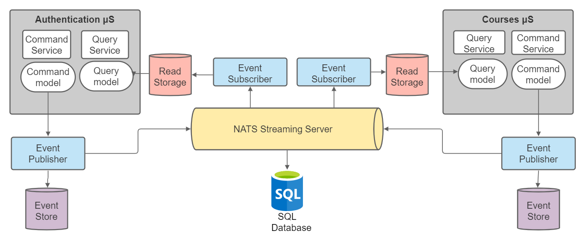
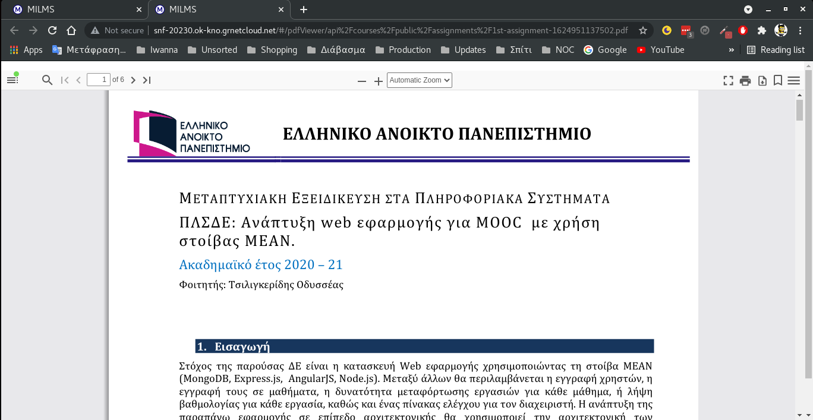

# MIcroservices-based Learning Management System (MILMS)

## FRAMEWORK

MILMS consists of a Framework of techniques, tools and technologies used for the implementation of a Learning Management System (LMS), which provides scalability, agility, high availability and continuous delivery.

The basic concepts, are the following:

- It's desing was aligned with the Domain Driven Design (DDD - First introduced by Evans, 2004) as shown in Fig.1,

|  |
| :---------------------------------------------------------------------------: |
|                   <b>Fig.1 - MILMS Domain Driven Design</b>                   |

- Services are separated, according to the Microservices (μSVCs) Architecture (providing service-isolation and independence, no one-point-of-failure), as shown in Fig. 2.

|  |
| :--------------------------------------------------------------------------------------: |
|                       <b>Fig.2 - μSVCs isolation architecture</b>                        |

- The communication between the μSVCs is implemented asychronously, with the help of NATS message broker,

|                   |
| :-------------------------------------------------------------------: |
| <b>Fig.3 - Asynchronous communication (NATS message/event broker)</b> |

- The communication between the frontend (Angular) and the backend (NodeJS, Express) μSVCs is implemented with Synchronous communication or Representation State Transfer (REST) approach, so that secure authentication/authorization is provided (using Json Web Tokens - JWT),

|  |
| :------------------------------------------------: |
|  <b>Fig.4 - JWT authentication/authorization</b>   |

- The Cluster has been implemented on top of Kubernetes(k8s) with Ingress-Nginx as Ingress-Controller for the provider's Load-Balancer,

|  |
| :--------------------------------------------------------------------------------: |
|                       <b>Fig.5 - Kubernetes Architecture</b>                       |

- With regard to the asynchronous communication through NATS message/event broker,the need for the publisher μSVC to roll back to the state before saving an unsent event-message arises. One proposed solution is called Event-Sourcing (ESC). However, as the queries to the Event Store increase in number so does the latency in its responses, until its quota upper limit is reached and it finally fails. In addition, since events are immutable, as long as events increase in number so does the required storage that maintains them. To address these issues Command Query Responsibility Segregation (CQRS) has been proposed. The Event Sourcing and CQRS implementation is shown in Fig. 6.

|  |
| :----------------------------------------------------------------------------: |
|                    <b>Fig.6 - Event Sourcing with CQRS</b>                     |

- With the purpose of succeeding high availability on the event-DBs, RIAK is proposed as the most appropriate Database Management System (DBMS), where each record is distributed in a number of nodes (represented with the same color in Fig.7),

|  |
| :-------------------------------------------------: |
|       <b>Fig.6 - Event Sourcing with CQRS</b>       |

## APPLICATION

In Figure 7, the sign-up form of the respective page is displayed, in which an “email-format” error message is displayed as an example. The user can also upload a profile image, which will be shown in the right-side of the main toolbar. If she is already registered (signed up), she can sign in with her email and password.

|  |
| :------------------------------------------------------: |
|                <b>Fig.7 - Signup page</b>                |

In figures 8 and 9, the Courses page is shown, displaying a list of the current courses. The former in the instructor/administrator interface and the latter in the student’s interface. In the first the user has the ability to edit the information regarding the course (title, description, year and semester) by clicking the blue pencil button. In addition she can delete each specific row/course by clicking the red garbage button. By clicking the light-blue expand button, the user is navigated to the corresponding course page. Finally by clicking the blue “Add Course” button on the bottom, the user may add a new course to the table. Filter functionality is also provided in the form of input text (as shown in Figure 8, below the tab-menu), where in each key-down event, the list is updated according the text in the input field.

|  |
| :------------------------------------------------------------------------------------: |
|           <b>Fig.8 - Courses page (administrator/instructor interface).</b>            |

In the UI of Figure 9, the user may filter the displayed courses in the list, by selecting the checkboxes in the right expandable side-navigation-toolbar. The filtering regards the year and the semester of the corresponding courses. Moreover, in each row/course there are three buttons the user can click, which may navigate her to the corresponding course page, register for the course, or navigate to the Lecture page for a real-time communication.

|  |
| :------------------------------------------------------------------------: |
|             <b>Fig.9 - Courses page (student's interface)</b>              |

In Figure 10, the course’s list of assignments is displayed in the instructor/administrator interface, while in Figure 18 an emerged dialog form is displayed in which an instructor can rank/assess a student’s delivery/answer (referring to all its corresponding files) for a specific assignment.

As shown in Figure 10, except for the edit, delete and expand buttons, provided as well in the courses table, the user may exploit some additional functionalities in the assignments page. The burgundy pdf button provides the opening of the pdf file in web-viewer, as it is presented in Figure 10. The light blue arrow button, triggers the download of the file to the local storage, and the light blue clipper button opens a File-System window for the selection of the file to upload.

|     |
| :-------------------------------------------------------------------: |
| <b>Fig.10 - Assignments page (administrator/instructor interface)</b> |

After the user clicks the blue expand button, and is navigated to the specific assignment’s page, as an instructor she can rank the assignment’s delivery (referring to one or more uploaded files) for each student. The form dialog that opens when she clicks the blue pencil button is displayed in Figure18, with the respective cancel and submit (ok) buttons.

|                                                    |
| :----------------------------------------------------------------------------------------------------: |
| <b>Fig.11 - Student Delivery Assignment page (instructor interface-ranking a student’s assignment)</b> |

Figure 12 displays the web pdf viewer page, with all the pdf management functionalities (e.g. rotate, print, download).

|  |
| :--------------------------------------------------------------: |
|               <b>Fig.12 - pdf Web viewer page</b>                |

Figure 13 depicts the upload material page, where a drag and drop component is present for uploading one or more files by the instructor, to be used as learning resources by students. The same component is re-used in almost all the pages that require file-uploading.

|                |
| :--------------------------------------------------------------------: |
| <b>Fig.13 - Upload material tab (with a drag & drop functionality)</b> |

Figure 14 demonstrates the Events page, containing the calendar component, so that the administrator could select a period of days for which she wants to inspect the user events.

|     |
| :---------------------------------------------------------------------------: |
| <b>Fig.14 - Period selection of the examined days, from emerged calendar.</b> |

After the period of days, for the displayed events, is selected, a list of the required events is displayed, as shown in Figure 22. In this figure a tab-menu is also present, including the “User Events” and “Course Events” tabs, in which the user may selects the event to be displayed. Both tab-pages present their events in a table, which is similar to the one shown in Figure 15.

|  |
| :------------------------------------------------------------------: |
|   <b>Fig.15 - Events table for user management-related events</b>    |

Moreover, tables and list pagination and sorting functionalities are also provided in each page, which contains a list or table.
